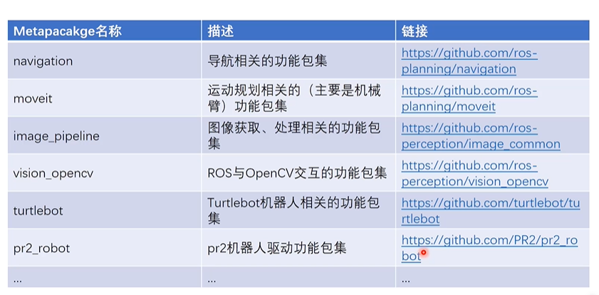
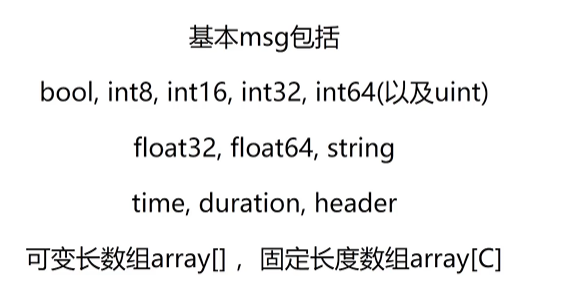
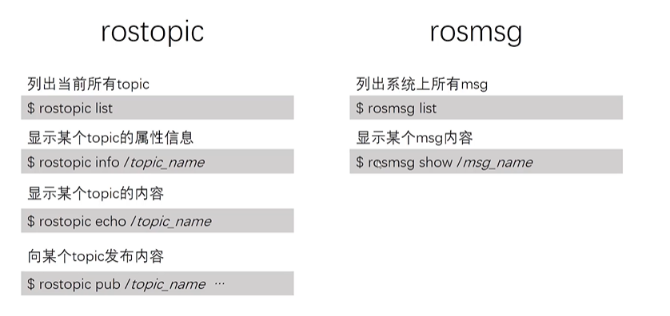
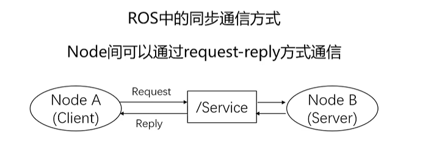
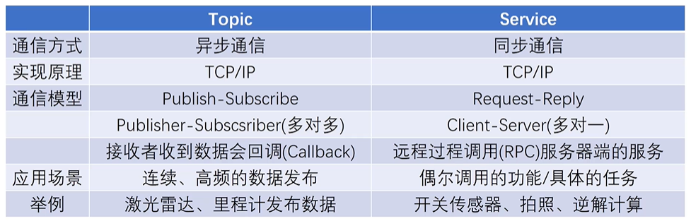
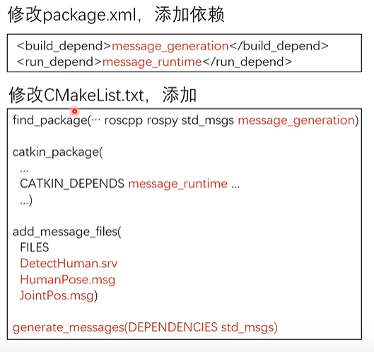

#### ROS通信架构

master与node

启动ros master

```shell
roscore
```

node为ros中的进程，pkg中运行的实例，以功能划分

```shell
rosrun
rosnode
rosnode list
rosnode info node_name
```

启动master与多个node

```shell
roslaunch
```

#### ROS通信方式

###### Topic通信方式
异步通信方式

调用publish发布topic

调用subscribe接受topic

都可以有多个

###### Topic内容的数据类型——Message

定义在*.msg文件中

基本msg







```shell
rostopic pub topic_name type param
```

###### Service通信方式




###### Topic与Service对比



Service通信的数据格式定义在*.srv中，在srv路径下

srv只能嵌套msg，不能嵌套srv

**在定义srv与msg后需要修改package.xml与CmakeList.txt**



