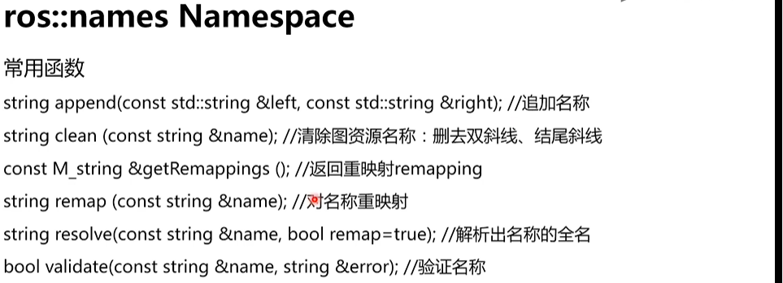

## ROS通信


#### ROS通信架构

master与node

启动ros master

```shell
roscore
```

node为ros中的进程，pkg中运行的实例，以功能划分

```shell
rosrun
rosnode
rosnode list
rosnode info node_name
```

启动master与多个node

```shell
roslaunch
```

#### ROS通信方式

##### Topic通信方式
异步通信方式

调用publish发布topic

调用subscribe接受topic

都可以有多个

###### Topic内容的数据类型——Message

定义在*.msg文件中

基本msg


```shell
rostopic pub topic_name type param
```

##### Service通信方式


###### Topic与Service对比


Service通信的数据格式定义在*.srv中，在srv路径下

srv只能嵌套msg，不能嵌套srv

**在定义srv与msg后需要修改package.xml与CmakeList.txt**


##### Action通信方式


action通信的数据格式定义在*.action文件中

具体写法：由三部分组成


#### Paramater Service

参数服务器——存储各种参数的字典，可以使用命令行、launch文件和node读写


- 可以保存为yaml文件格式

- 使用launch文件读写

param与rospapram


- 使用node中的API对其进行读写

## ROS常用工具


#### Gazebo

仿真器，还有V-Rrp，Carsim等

Gazebo主要使用ode物理引擎，还有Bullet或其它物理引擎

#### RViz

可视化工具，方便监控和调试

#### rqt

可视化工具

常用：rqt_graph,rqt_plot,rqt_console

```shell
rosrun rqt
```

#### rosbag

ROS命令行工具，记录和回放数据流

会将数据保存在*.bag文件里


## ROS编程

#### Client Library

提供ROS编程的库，类似于API，提供了roscpp，rospy等

###### roscpp


- ros::NodeHandler是一个类，使用时先创建其对象，然后再创建其功能


- ros::master是一个命名空间


- ros::this_node是一个命名空间，获取当前node相关的信息


- ros::service是一个命名空间


- ros::names是一个命名空间



### roscpp编程

#### Topic编程

例如实现一个功能：一个node发送一个自定义信息，另一个node订阅并进行计算

实现步骤：
- package
- msg
- talker.cpp
- listener.cpp
- CmakeList.txt&package.xml

1.创建package，使用shell命令


2.创建msg

编译后才能使用


使用时，需要
```c++
#include <topic_demo/gps.cpp>
```

3.编写talker.cpp


4.编写listener.cpp


5.修改CmakeList.txt与package.xml


在完成上述操作后，即可使用shell命令调用

#### Service编程

两个node，一个node发布请求，另一个node接受该信息，处理后返回信息

实现步骤：
- package
- srv
- server.cpp
- client.cpp
- CmakeList.txt&package.xml

1.创建package，使用shell命令

2.编写srv


会生成几个头文件

3.编写server.cpp


4.编写client.cpp


5.修改CmakeList.txt与package.xml


#### Paramater Service编写

有两种API可以对其进行操作：

ros::param

ros::NodeHandler

在代码中对参数进行操作


在launch文件中对参数进行操作


### rospy编程

常用函数:
- Node
- Topic
- Service
- Param
- Time

无论使用什么函数都需要
```python
import rospy
```

###### 1.Node相关函数


###### 2.Tpoic相关函数


